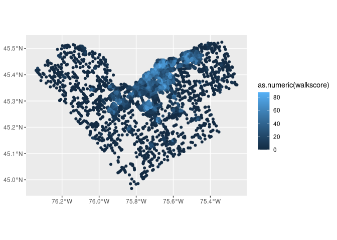
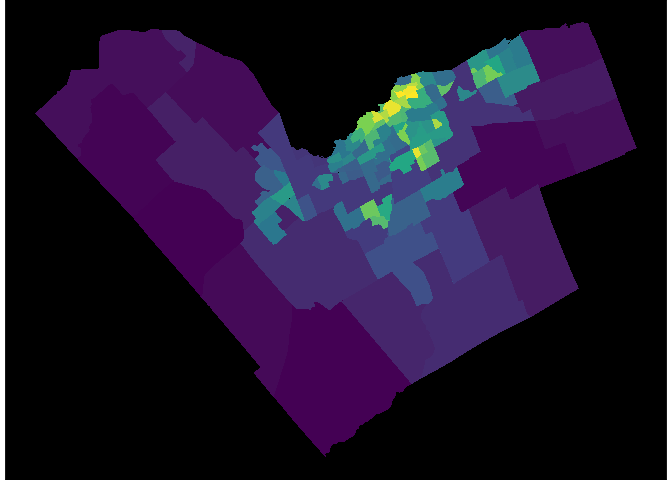

<!-- README.md is generated from README.Rmd. Please edit that file -->

# Ottawa Neighbourhood Study: Walkscores Analysis

To better understand walkability in Ottawa, Ontario, this analysis
computed walkscores for 10,992 points across 116 neighbourhoods and
tabulated neighbourhood-level statistics.

## Methodology

In each neighbourhood, approximately 100 points on road networks were
randomly selected for analysis. Origin points were taken from the
[Pseudo-Household Demographic Distribution (PHH) data
file](https://open.canada.ca/data/en/dataset/b3a1d603-19ca-466c-ae95-b5185e56addf)
produced by the Government of Canada’s Department of Innovation, Science
and Economic Development. PHHs were filtered to point types 3 and 4
(points on non-highway roads). Then, for each neighbourhood, either 100
PHHs or the maximum number available within their boundaries were
selected. These points were then scored using the Walkscore API in
several batches between February 9 and February 16, 2023. Means and
standard deviations were calculated for each neighbourhood.

Population-weighted means and standard deviations were also calculated
for each neighbourhood. Each PHH in the PHH dataset comes assigned a
population based on its Statistics Canada dissemination block (DB). We
multiplied each PHH’s walkscore by its population, then calculated
neighbourhood-level values as, for each PHH i, sum(PHH_walkscore \*
PHH_population) / sum(PHH_population).”

## Results

### Plots

Results for each of the 10,992 points are visualized below:

<!-- -->

And neighbourhood-level mean walkscores are presented below:

<!-- -->

### Data Tables

<table class="gt_table">
  <thead class="gt_header">
    <tr>
      <td colspan="4" class="gt_heading gt_title gt_font_normal" style>Ottawa Neighbourhood-Level Walk Scores</td>
    </tr>
    <tr>
      <td colspan="4" class="gt_heading gt_subtitle gt_font_normal gt_bottom_border" style>Population-weighted means based on 2016 census data</td>
    </tr>
  </thead>
  <thead class="gt_col_headings">
    <tr>
      <th class="gt_col_heading gt_columns_bottom_border gt_right" rowspan="1" colspan="1" scope="col" id="ONS_ID">ONS_ID</th>
      <th class="gt_col_heading gt_columns_bottom_border gt_right" rowspan="1" colspan="1" scope="col" id="Mean">Mean</th>
      <th class="gt_col_heading gt_columns_bottom_border gt_right" rowspan="1" colspan="1" style="border-right-width: 1px; border-right-style: dashed; border-right-color: #000000;" scope="col" id="St. Dev.">St. Dev.</th>
      <th class="gt_col_heading gt_columns_bottom_border gt_right" rowspan="1" colspan="1" scope="col" id="Pop. Wt. Mean">Pop. Wt. Mean</th>
    </tr>
  </thead>
  <tbody class="gt_table_body">
    <tr><td headers="ONS_ID" class="gt_row gt_right">3001</td>
<td headers="walkscore_mean" class="gt_row gt_right">12.77</td>
<td headers="walkscore_sd" class="gt_row gt_right" style="border-right-width: 1px; border-right-style: dashed; border-right-color: #000000;">11.65</td>
<td headers="walkscore_popweighted_mean" class="gt_row gt_right">11.83</td></tr>
    <tr><td headers="ONS_ID" class="gt_row gt_right">3002</td>
<td headers="walkscore_mean" class="gt_row gt_right">36.78</td>
<td headers="walkscore_sd" class="gt_row gt_right" style="border-right-width: 1px; border-right-style: dashed; border-right-color: #000000;">21.86</td>
<td headers="walkscore_popweighted_mean" class="gt_row gt_right">33.88</td></tr>
    <tr><td headers="ONS_ID" class="gt_row gt_right">3003</td>
<td headers="walkscore_mean" class="gt_row gt_right">35.54</td>
<td headers="walkscore_sd" class="gt_row gt_right" style="border-right-width: 1px; border-right-style: dashed; border-right-color: #000000;">6.82</td>
<td headers="walkscore_popweighted_mean" class="gt_row gt_right">35.29</td></tr>
    <tr><td headers="ONS_ID" class="gt_row gt_right">3004</td>
<td headers="walkscore_mean" class="gt_row gt_right">51.56</td>
<td headers="walkscore_sd" class="gt_row gt_right" style="border-right-width: 1px; border-right-style: dashed; border-right-color: #000000;">4.67</td>
<td headers="walkscore_popweighted_mean" class="gt_row gt_right">52.22</td></tr>
    <tr><td headers="ONS_ID" class="gt_row gt_right">3005</td>
<td headers="walkscore_mean" class="gt_row gt_right">28.96</td>
<td headers="walkscore_sd" class="gt_row gt_right" style="border-right-width: 1px; border-right-style: dashed; border-right-color: #000000;">8.20</td>
<td headers="walkscore_popweighted_mean" class="gt_row gt_right">28.28</td></tr>
    <tr><td headers="ONS_ID" class="gt_row gt_right">3006</td>
<td headers="walkscore_mean" class="gt_row gt_right">63.40</td>
<td headers="walkscore_sd" class="gt_row gt_right" style="border-right-width: 1px; border-right-style: dashed; border-right-color: #000000;">10.20</td>
<td headers="walkscore_popweighted_mean" class="gt_row gt_right">63.40</td></tr>
    <tr><td headers="ONS_ID" class="gt_row gt_right">3007</td>
<td headers="walkscore_mean" class="gt_row gt_right">33.79</td>
<td headers="walkscore_sd" class="gt_row gt_right" style="border-right-width: 1px; border-right-style: dashed; border-right-color: #000000;">13.48</td>
<td headers="walkscore_popweighted_mean" class="gt_row gt_right">33.21</td></tr>
    <tr><td headers="ONS_ID" class="gt_row gt_right">3008</td>
<td headers="walkscore_mean" class="gt_row gt_right">26.12</td>
<td headers="walkscore_sd" class="gt_row gt_right" style="border-right-width: 1px; border-right-style: dashed; border-right-color: #000000;">6.57</td>
<td headers="walkscore_popweighted_mean" class="gt_row gt_right">25.03</td></tr>
    <tr><td headers="ONS_ID" class="gt_row gt_right">3009</td>
<td headers="walkscore_mean" class="gt_row gt_right">57.27</td>
<td headers="walkscore_sd" class="gt_row gt_right" style="border-right-width: 1px; border-right-style: dashed; border-right-color: #000000;">14.05</td>
<td headers="walkscore_popweighted_mean" class="gt_row gt_right">56.35</td></tr>
    <tr><td headers="ONS_ID" class="gt_row gt_right">3010</td>
<td headers="walkscore_mean" class="gt_row gt_right">33.32</td>
<td headers="walkscore_sd" class="gt_row gt_right" style="border-right-width: 1px; border-right-style: dashed; border-right-color: #000000;">7.18</td>
<td headers="walkscore_popweighted_mean" class="gt_row gt_right">33.71</td></tr>
    <tr><td headers="ONS_ID" class="gt_row gt_right">3011</td>
<td headers="walkscore_mean" class="gt_row gt_right">49.80</td>
<td headers="walkscore_sd" class="gt_row gt_right" style="border-right-width: 1px; border-right-style: dashed; border-right-color: #000000;">12.78</td>
<td headers="walkscore_popweighted_mean" class="gt_row gt_right">47.44</td></tr>
    <tr><td headers="ONS_ID" class="gt_row gt_right">3012</td>
<td headers="walkscore_mean" class="gt_row gt_right">26.23</td>
<td headers="walkscore_sd" class="gt_row gt_right" style="border-right-width: 1px; border-right-style: dashed; border-right-color: #000000;">9.33</td>
<td headers="walkscore_popweighted_mean" class="gt_row gt_right">27.59</td></tr>
    <tr><td headers="ONS_ID" class="gt_row gt_right">3013</td>
<td headers="walkscore_mean" class="gt_row gt_right">24.41</td>
<td headers="walkscore_sd" class="gt_row gt_right" style="border-right-width: 1px; border-right-style: dashed; border-right-color: #000000;">11.71</td>
<td headers="walkscore_popweighted_mean" class="gt_row gt_right">24.69</td></tr>
    <tr><td headers="ONS_ID" class="gt_row gt_right">3014</td>
<td headers="walkscore_mean" class="gt_row gt_right">18.45</td>
<td headers="walkscore_sd" class="gt_row gt_right" style="border-right-width: 1px; border-right-style: dashed; border-right-color: #000000;">7.74</td>
<td headers="walkscore_popweighted_mean" class="gt_row gt_right">18.47</td></tr>
    <tr><td headers="ONS_ID" class="gt_row gt_right">3015</td>
<td headers="walkscore_mean" class="gt_row gt_right">27.77</td>
<td headers="walkscore_sd" class="gt_row gt_right" style="border-right-width: 1px; border-right-style: dashed; border-right-color: #000000;">10.76</td>
<td headers="walkscore_popweighted_mean" class="gt_row gt_right">29.74</td></tr>
    <tr><td headers="ONS_ID" class="gt_row gt_right">3016</td>
<td headers="walkscore_mean" class="gt_row gt_right">19.53</td>
<td headers="walkscore_sd" class="gt_row gt_right" style="border-right-width: 1px; border-right-style: dashed; border-right-color: #000000;">9.77</td>
<td headers="walkscore_popweighted_mean" class="gt_row gt_right">20.19</td></tr>
    <tr><td headers="ONS_ID" class="gt_row gt_right">3017</td>
<td headers="walkscore_mean" class="gt_row gt_right">29.60</td>
<td headers="walkscore_sd" class="gt_row gt_right" style="border-right-width: 1px; border-right-style: dashed; border-right-color: #000000;">13.73</td>
<td headers="walkscore_popweighted_mean" class="gt_row gt_right">31.93</td></tr>
    <tr><td headers="ONS_ID" class="gt_row gt_right">3018</td>
<td headers="walkscore_mean" class="gt_row gt_right">26.23</td>
<td headers="walkscore_sd" class="gt_row gt_right" style="border-right-width: 1px; border-right-style: dashed; border-right-color: #000000;">5.38</td>
<td headers="walkscore_popweighted_mean" class="gt_row gt_right">26.82</td></tr>
    <tr><td headers="ONS_ID" class="gt_row gt_right">3019</td>
<td headers="walkscore_mean" class="gt_row gt_right">26.17</td>
<td headers="walkscore_sd" class="gt_row gt_right" style="border-right-width: 1px; border-right-style: dashed; border-right-color: #000000;">6.59</td>
<td headers="walkscore_popweighted_mean" class="gt_row gt_right">26.17</td></tr>
    <tr><td headers="ONS_ID" class="gt_row gt_right">3020</td>
<td headers="walkscore_mean" class="gt_row gt_right">48.08</td>
<td headers="walkscore_sd" class="gt_row gt_right" style="border-right-width: 1px; border-right-style: dashed; border-right-color: #000000;">10.21</td>
<td headers="walkscore_popweighted_mean" class="gt_row gt_right">45.86</td></tr>
    <tr><td headers="ONS_ID" class="gt_row gt_right">3021</td>
<td headers="walkscore_mean" class="gt_row gt_right">5.36</td>
<td headers="walkscore_sd" class="gt_row gt_right" style="border-right-width: 1px; border-right-style: dashed; border-right-color: #000000;">10.13</td>
<td headers="walkscore_popweighted_mean" class="gt_row gt_right">6.91</td></tr>
    <tr><td headers="ONS_ID" class="gt_row gt_right">3022</td>
<td headers="walkscore_mean" class="gt_row gt_right">24.84</td>
<td headers="walkscore_sd" class="gt_row gt_right" style="border-right-width: 1px; border-right-style: dashed; border-right-color: #000000;">8.66</td>
<td headers="walkscore_popweighted_mean" class="gt_row gt_right">24.56</td></tr>
    <tr><td headers="ONS_ID" class="gt_row gt_right">3023</td>
<td headers="walkscore_mean" class="gt_row gt_right">21.68</td>
<td headers="walkscore_sd" class="gt_row gt_right" style="border-right-width: 1px; border-right-style: dashed; border-right-color: #000000;">8.22</td>
<td headers="walkscore_popweighted_mean" class="gt_row gt_right">22.62</td></tr>
    <tr><td headers="ONS_ID" class="gt_row gt_right">3024</td>
<td headers="walkscore_mean" class="gt_row gt_right">68.97</td>
<td headers="walkscore_sd" class="gt_row gt_right" style="border-right-width: 1px; border-right-style: dashed; border-right-color: #000000;">11.00</td>
<td headers="walkscore_popweighted_mean" class="gt_row gt_right">70.81</td></tr>
    <tr><td headers="ONS_ID" class="gt_row gt_right">3025</td>
<td headers="walkscore_mean" class="gt_row gt_right">47.68</td>
<td headers="walkscore_sd" class="gt_row gt_right" style="border-right-width: 1px; border-right-style: dashed; border-right-color: #000000;">13.66</td>
<td headers="walkscore_popweighted_mean" class="gt_row gt_right">46.12</td></tr>
    <tr><td headers="ONS_ID" class="gt_row gt_right">3026</td>
<td headers="walkscore_mean" class="gt_row gt_right">21.34</td>
<td headers="walkscore_sd" class="gt_row gt_right" style="border-right-width: 1px; border-right-style: dashed; border-right-color: #000000;">14.24</td>
<td headers="walkscore_popweighted_mean" class="gt_row gt_right">22.02</td></tr>
    <tr><td headers="ONS_ID" class="gt_row gt_right">3027</td>
<td headers="walkscore_mean" class="gt_row gt_right">49.34</td>
<td headers="walkscore_sd" class="gt_row gt_right" style="border-right-width: 1px; border-right-style: dashed; border-right-color: #000000;">17.28</td>
<td headers="walkscore_popweighted_mean" class="gt_row gt_right">53.54</td></tr>
    <tr><td headers="ONS_ID" class="gt_row gt_right">3028</td>
<td headers="walkscore_mean" class="gt_row gt_right">37.84</td>
<td headers="walkscore_sd" class="gt_row gt_right" style="border-right-width: 1px; border-right-style: dashed; border-right-color: #000000;">11.79</td>
<td headers="walkscore_popweighted_mean" class="gt_row gt_right">33.10</td></tr>
    <tr><td headers="ONS_ID" class="gt_row gt_right">3029</td>
<td headers="walkscore_mean" class="gt_row gt_right">51.62</td>
<td headers="walkscore_sd" class="gt_row gt_right" style="border-right-width: 1px; border-right-style: dashed; border-right-color: #000000;">6.94</td>
<td headers="walkscore_popweighted_mean" class="gt_row gt_right">51.01</td></tr>
    <tr><td headers="ONS_ID" class="gt_row gt_right">3030</td>
<td headers="walkscore_mean" class="gt_row gt_right">20.48</td>
<td headers="walkscore_sd" class="gt_row gt_right" style="border-right-width: 1px; border-right-style: dashed; border-right-color: #000000;">9.48</td>
<td headers="walkscore_popweighted_mean" class="gt_row gt_right">26.45</td></tr>
    <tr><td headers="ONS_ID" class="gt_row gt_right">3031</td>
<td headers="walkscore_mean" class="gt_row gt_right">6.19</td>
<td headers="walkscore_sd" class="gt_row gt_right" style="border-right-width: 1px; border-right-style: dashed; border-right-color: #000000;">6.14</td>
<td headers="walkscore_popweighted_mean" class="gt_row gt_right">5.82</td></tr>
    <tr><td headers="ONS_ID" class="gt_row gt_right">3032</td>
<td headers="walkscore_mean" class="gt_row gt_right">37.60</td>
<td headers="walkscore_sd" class="gt_row gt_right" style="border-right-width: 1px; border-right-style: dashed; border-right-color: #000000;">17.85</td>
<td headers="walkscore_popweighted_mean" class="gt_row gt_right">36.53</td></tr>
    <tr><td headers="ONS_ID" class="gt_row gt_right">3033</td>
<td headers="walkscore_mean" class="gt_row gt_right">0.24</td>
<td headers="walkscore_sd" class="gt_row gt_right" style="border-right-width: 1px; border-right-style: dashed; border-right-color: #000000;">0.78</td>
<td headers="walkscore_popweighted_mean" class="gt_row gt_right">0.33</td></tr>
    <tr><td headers="ONS_ID" class="gt_row gt_right">3034</td>
<td headers="walkscore_mean" class="gt_row gt_right">21.04</td>
<td headers="walkscore_sd" class="gt_row gt_right" style="border-right-width: 1px; border-right-style: dashed; border-right-color: #000000;">9.25</td>
<td headers="walkscore_popweighted_mean" class="gt_row gt_right">20.50</td></tr>
    <tr><td headers="ONS_ID" class="gt_row gt_right">3035</td>
<td headers="walkscore_mean" class="gt_row gt_right">24.71</td>
<td headers="walkscore_sd" class="gt_row gt_right" style="border-right-width: 1px; border-right-style: dashed; border-right-color: #000000;">11.53</td>
<td headers="walkscore_popweighted_mean" class="gt_row gt_right">23.28</td></tr>
    <tr><td headers="ONS_ID" class="gt_row gt_right">3036</td>
<td headers="walkscore_mean" class="gt_row gt_right">10.48</td>
<td headers="walkscore_sd" class="gt_row gt_right" style="border-right-width: 1px; border-right-style: dashed; border-right-color: #000000;">4.70</td>
<td headers="walkscore_popweighted_mean" class="gt_row gt_right">10.96</td></tr>
    <tr><td headers="ONS_ID" class="gt_row gt_right">3037</td>
<td headers="walkscore_mean" class="gt_row gt_right">2.13</td>
<td headers="walkscore_sd" class="gt_row gt_right" style="border-right-width: 1px; border-right-style: dashed; border-right-color: #000000;">3.88</td>
<td headers="walkscore_popweighted_mean" class="gt_row gt_right">1.67</td></tr>
    <tr><td headers="ONS_ID" class="gt_row gt_right">3038</td>
<td headers="walkscore_mean" class="gt_row gt_right">1.66</td>
<td headers="walkscore_sd" class="gt_row gt_right" style="border-right-width: 1px; border-right-style: dashed; border-right-color: #000000;">4.98</td>
<td headers="walkscore_popweighted_mean" class="gt_row gt_right">2.35</td></tr>
    <tr><td headers="ONS_ID" class="gt_row gt_right">3039</td>
<td headers="walkscore_mean" class="gt_row gt_right">0.74</td>
<td headers="walkscore_sd" class="gt_row gt_right" style="border-right-width: 1px; border-right-style: dashed; border-right-color: #000000;">3.96</td>
<td headers="walkscore_popweighted_mean" class="gt_row gt_right">0.59</td></tr>
    <tr><td headers="ONS_ID" class="gt_row gt_right">3040</td>
<td headers="walkscore_mean" class="gt_row gt_right">36.74</td>
<td headers="walkscore_sd" class="gt_row gt_right" style="border-right-width: 1px; border-right-style: dashed; border-right-color: #000000;">16.33</td>
<td headers="walkscore_popweighted_mean" class="gt_row gt_right">35.05</td></tr>
    <tr><td headers="ONS_ID" class="gt_row gt_right">3041</td>
<td headers="walkscore_mean" class="gt_row gt_right">56.08</td>
<td headers="walkscore_sd" class="gt_row gt_right" style="border-right-width: 1px; border-right-style: dashed; border-right-color: #000000;">12.34</td>
<td headers="walkscore_popweighted_mean" class="gt_row gt_right">59.02</td></tr>
    <tr><td headers="ONS_ID" class="gt_row gt_right">3042</td>
<td headers="walkscore_mean" class="gt_row gt_right">31.75</td>
<td headers="walkscore_sd" class="gt_row gt_right" style="border-right-width: 1px; border-right-style: dashed; border-right-color: #000000;">9.31</td>
<td headers="walkscore_popweighted_mean" class="gt_row gt_right">35.64</td></tr>
    <tr><td headers="ONS_ID" class="gt_row gt_right">3043</td>
<td headers="walkscore_mean" class="gt_row gt_right">31.79</td>
<td headers="walkscore_sd" class="gt_row gt_right" style="border-right-width: 1px; border-right-style: dashed; border-right-color: #000000;">8.20</td>
<td headers="walkscore_popweighted_mean" class="gt_row gt_right">31.64</td></tr>
    <tr><td headers="ONS_ID" class="gt_row gt_right">3044</td>
<td headers="walkscore_mean" class="gt_row gt_right">30.13</td>
<td headers="walkscore_sd" class="gt_row gt_right" style="border-right-width: 1px; border-right-style: dashed; border-right-color: #000000;">17.67</td>
<td headers="walkscore_popweighted_mean" class="gt_row gt_right">31.88</td></tr>
    <tr><td headers="ONS_ID" class="gt_row gt_right">3045</td>
<td headers="walkscore_mean" class="gt_row gt_right">38.49</td>
<td headers="walkscore_sd" class="gt_row gt_right" style="border-right-width: 1px; border-right-style: dashed; border-right-color: #000000;">8.05</td>
<td headers="walkscore_popweighted_mean" class="gt_row gt_right">40.67</td></tr>
    <tr><td headers="ONS_ID" class="gt_row gt_right">3046</td>
<td headers="walkscore_mean" class="gt_row gt_right">2.23</td>
<td headers="walkscore_sd" class="gt_row gt_right" style="border-right-width: 1px; border-right-style: dashed; border-right-color: #000000;">4.74</td>
<td headers="walkscore_popweighted_mean" class="gt_row gt_right">2.41</td></tr>
    <tr><td headers="ONS_ID" class="gt_row gt_right">3047</td>
<td headers="walkscore_mean" class="gt_row gt_right">48.85</td>
<td headers="walkscore_sd" class="gt_row gt_right" style="border-right-width: 1px; border-right-style: dashed; border-right-color: #000000;">8.91</td>
<td headers="walkscore_popweighted_mean" class="gt_row gt_right">49.65</td></tr>
    <tr><td headers="ONS_ID" class="gt_row gt_right">3048</td>
<td headers="walkscore_mean" class="gt_row gt_right">32.71</td>
<td headers="walkscore_sd" class="gt_row gt_right" style="border-right-width: 1px; border-right-style: dashed; border-right-color: #000000;">14.57</td>
<td headers="walkscore_popweighted_mean" class="gt_row gt_right">32.38</td></tr>
    <tr><td headers="ONS_ID" class="gt_row gt_right">3049</td>
<td headers="walkscore_mean" class="gt_row gt_right">11.90</td>
<td headers="walkscore_sd" class="gt_row gt_right" style="border-right-width: 1px; border-right-style: dashed; border-right-color: #000000;">11.50</td>
<td headers="walkscore_popweighted_mean" class="gt_row gt_right">9.33</td></tr>
    <tr><td headers="ONS_ID" class="gt_row gt_right">3050</td>
<td headers="walkscore_mean" class="gt_row gt_right">10.08</td>
<td headers="walkscore_sd" class="gt_row gt_right" style="border-right-width: 1px; border-right-style: dashed; border-right-color: #000000;">11.67</td>
<td headers="walkscore_popweighted_mean" class="gt_row gt_right">13.95</td></tr>
    <tr><td headers="ONS_ID" class="gt_row gt_right">3051</td>
<td headers="walkscore_mean" class="gt_row gt_right">11.51</td>
<td headers="walkscore_sd" class="gt_row gt_right" style="border-right-width: 1px; border-right-style: dashed; border-right-color: #000000;">14.85</td>
<td headers="walkscore_popweighted_mean" class="gt_row gt_right">15.90</td></tr>
    <tr><td headers="ONS_ID" class="gt_row gt_right">3052</td>
<td headers="walkscore_mean" class="gt_row gt_right">49.34</td>
<td headers="walkscore_sd" class="gt_row gt_right" style="border-right-width: 1px; border-right-style: dashed; border-right-color: #000000;">5.19</td>
<td headers="walkscore_popweighted_mean" class="gt_row gt_right">49.43</td></tr>
    <tr><td headers="ONS_ID" class="gt_row gt_right">3053</td>
<td headers="walkscore_mean" class="gt_row gt_right">53.98</td>
<td headers="walkscore_sd" class="gt_row gt_right" style="border-right-width: 1px; border-right-style: dashed; border-right-color: #000000;">9.29</td>
<td headers="walkscore_popweighted_mean" class="gt_row gt_right">54.99</td></tr>
    <tr><td headers="ONS_ID" class="gt_row gt_right">3054</td>
<td headers="walkscore_mean" class="gt_row gt_right">62.04</td>
<td headers="walkscore_sd" class="gt_row gt_right" style="border-right-width: 1px; border-right-style: dashed; border-right-color: #000000;">5.80</td>
<td headers="walkscore_popweighted_mean" class="gt_row gt_right">61.68</td></tr>
    <tr><td headers="ONS_ID" class="gt_row gt_right">3055</td>
<td headers="walkscore_mean" class="gt_row gt_right">66.96</td>
<td headers="walkscore_sd" class="gt_row gt_right" style="border-right-width: 1px; border-right-style: dashed; border-right-color: #000000;">6.42</td>
<td headers="walkscore_popweighted_mean" class="gt_row gt_right">66.21</td></tr>
    <tr><td headers="ONS_ID" class="gt_row gt_right">3056</td>
<td headers="walkscore_mean" class="gt_row gt_right">36.73</td>
<td headers="walkscore_sd" class="gt_row gt_right" style="border-right-width: 1px; border-right-style: dashed; border-right-color: #000000;">9.66</td>
<td headers="walkscore_popweighted_mean" class="gt_row gt_right">36.57</td></tr>
    <tr><td headers="ONS_ID" class="gt_row gt_right">3057</td>
<td headers="walkscore_mean" class="gt_row gt_right">38.93</td>
<td headers="walkscore_sd" class="gt_row gt_right" style="border-right-width: 1px; border-right-style: dashed; border-right-color: #000000;">13.37</td>
<td headers="walkscore_popweighted_mean" class="gt_row gt_right">46.16</td></tr>
    <tr><td headers="ONS_ID" class="gt_row gt_right">3058</td>
<td headers="walkscore_mean" class="gt_row gt_right">33.26</td>
<td headers="walkscore_sd" class="gt_row gt_right" style="border-right-width: 1px; border-right-style: dashed; border-right-color: #000000;">5.11</td>
<td headers="walkscore_popweighted_mean" class="gt_row gt_right">33.71</td></tr>
    <tr><td headers="ONS_ID" class="gt_row gt_right">3059</td>
<td headers="walkscore_mean" class="gt_row gt_right">57.09</td>
<td headers="walkscore_sd" class="gt_row gt_right" style="border-right-width: 1px; border-right-style: dashed; border-right-color: #000000;">15.57</td>
<td headers="walkscore_popweighted_mean" class="gt_row gt_right">59.26</td></tr>
    <tr><td headers="ONS_ID" class="gt_row gt_right">3060</td>
<td headers="walkscore_mean" class="gt_row gt_right">22.39</td>
<td headers="walkscore_sd" class="gt_row gt_right" style="border-right-width: 1px; border-right-style: dashed; border-right-color: #000000;">8.74</td>
<td headers="walkscore_popweighted_mean" class="gt_row gt_right">24.07</td></tr>
    <tr><td headers="ONS_ID" class="gt_row gt_right">3061</td>
<td headers="walkscore_mean" class="gt_row gt_right">38.84</td>
<td headers="walkscore_sd" class="gt_row gt_right" style="border-right-width: 1px; border-right-style: dashed; border-right-color: #000000;">9.45</td>
<td headers="walkscore_popweighted_mean" class="gt_row gt_right">38.54</td></tr>
    <tr><td headers="ONS_ID" class="gt_row gt_right">3062</td>
<td headers="walkscore_mean" class="gt_row gt_right">0.60</td>
<td headers="walkscore_sd" class="gt_row gt_right" style="border-right-width: 1px; border-right-style: dashed; border-right-color: #000000;">2.16</td>
<td headers="walkscore_popweighted_mean" class="gt_row gt_right">0.69</td></tr>
    <tr><td headers="ONS_ID" class="gt_row gt_right">3063</td>
<td headers="walkscore_mean" class="gt_row gt_right">45.73</td>
<td headers="walkscore_sd" class="gt_row gt_right" style="border-right-width: 1px; border-right-style: dashed; border-right-color: #000000;">9.21</td>
<td headers="walkscore_popweighted_mean" class="gt_row gt_right">45.33</td></tr>
    <tr><td headers="ONS_ID" class="gt_row gt_right">3064</td>
<td headers="walkscore_mean" class="gt_row gt_right">49.33</td>
<td headers="walkscore_sd" class="gt_row gt_right" style="border-right-width: 1px; border-right-style: dashed; border-right-color: #000000;">4.62</td>
<td headers="walkscore_popweighted_mean" class="gt_row gt_right">49.33</td></tr>
    <tr><td headers="ONS_ID" class="gt_row gt_right">3065</td>
<td headers="walkscore_mean" class="gt_row gt_right">39.86</td>
<td headers="walkscore_sd" class="gt_row gt_right" style="border-right-width: 1px; border-right-style: dashed; border-right-color: #000000;">6.48</td>
<td headers="walkscore_popweighted_mean" class="gt_row gt_right">38.71</td></tr>
    <tr><td headers="ONS_ID" class="gt_row gt_right">3066</td>
<td headers="walkscore_mean" class="gt_row gt_right">22.50</td>
<td headers="walkscore_sd" class="gt_row gt_right" style="border-right-width: 1px; border-right-style: dashed; border-right-color: #000000;">8.05</td>
<td headers="walkscore_popweighted_mean" class="gt_row gt_right">21.25</td></tr>
    <tr><td headers="ONS_ID" class="gt_row gt_right">3067</td>
<td headers="walkscore_mean" class="gt_row gt_right">71.44</td>
<td headers="walkscore_sd" class="gt_row gt_right" style="border-right-width: 1px; border-right-style: dashed; border-right-color: #000000;">9.00</td>
<td headers="walkscore_popweighted_mean" class="gt_row gt_right">72.75</td></tr>
    <tr><td headers="ONS_ID" class="gt_row gt_right">3068</td>
<td headers="walkscore_mean" class="gt_row gt_right">58.43</td>
<td headers="walkscore_sd" class="gt_row gt_right" style="border-right-width: 1px; border-right-style: dashed; border-right-color: #000000;">9.09</td>
<td headers="walkscore_popweighted_mean" class="gt_row gt_right">57.43</td></tr>
    <tr><td headers="ONS_ID" class="gt_row gt_right">3069</td>
<td headers="walkscore_mean" class="gt_row gt_right">58.38</td>
<td headers="walkscore_sd" class="gt_row gt_right" style="border-right-width: 1px; border-right-style: dashed; border-right-color: #000000;">14.13</td>
<td headers="walkscore_popweighted_mean" class="gt_row gt_right">59.50</td></tr>
    <tr><td headers="ONS_ID" class="gt_row gt_right">3070</td>
<td headers="walkscore_mean" class="gt_row gt_right">17.69</td>
<td headers="walkscore_sd" class="gt_row gt_right" style="border-right-width: 1px; border-right-style: dashed; border-right-color: #000000;">22.96</td>
<td headers="walkscore_popweighted_mean" class="gt_row gt_right">14.51</td></tr>
    <tr><td headers="ONS_ID" class="gt_row gt_right">3071</td>
<td headers="walkscore_mean" class="gt_row gt_right">0.19</td>
<td headers="walkscore_sd" class="gt_row gt_right" style="border-right-width: 1px; border-right-style: dashed; border-right-color: #000000;">0.94</td>
<td headers="walkscore_popweighted_mean" class="gt_row gt_right">0.21</td></tr>
    <tr><td headers="ONS_ID" class="gt_row gt_right">3072</td>
<td headers="walkscore_mean" class="gt_row gt_right">24.51</td>
<td headers="walkscore_sd" class="gt_row gt_right" style="border-right-width: 1px; border-right-style: dashed; border-right-color: #000000;">10.32</td>
<td headers="walkscore_popweighted_mean" class="gt_row gt_right">24.92</td></tr>
    <tr><td headers="ONS_ID" class="gt_row gt_right">3073</td>
<td headers="walkscore_mean" class="gt_row gt_right">4.52</td>
<td headers="walkscore_sd" class="gt_row gt_right" style="border-right-width: 1px; border-right-style: dashed; border-right-color: #000000;">8.54</td>
<td headers="walkscore_popweighted_mean" class="gt_row gt_right">6.47</td></tr>
    <tr><td headers="ONS_ID" class="gt_row gt_right">3074</td>
<td headers="walkscore_mean" class="gt_row gt_right">8.29</td>
<td headers="walkscore_sd" class="gt_row gt_right" style="border-right-width: 1px; border-right-style: dashed; border-right-color: #000000;">11.65</td>
<td headers="walkscore_popweighted_mean" class="gt_row gt_right">11.37</td></tr>
    <tr><td headers="ONS_ID" class="gt_row gt_right">3075</td>
<td headers="walkscore_mean" class="gt_row gt_right">1.41</td>
<td headers="walkscore_sd" class="gt_row gt_right" style="border-right-width: 1px; border-right-style: dashed; border-right-color: #000000;">2.77</td>
<td headers="walkscore_popweighted_mean" class="gt_row gt_right">1.93</td></tr>
    <tr><td headers="ONS_ID" class="gt_row gt_right">3076</td>
<td headers="walkscore_mean" class="gt_row gt_right">4.46</td>
<td headers="walkscore_sd" class="gt_row gt_right" style="border-right-width: 1px; border-right-style: dashed; border-right-color: #000000;">6.34</td>
<td headers="walkscore_popweighted_mean" class="gt_row gt_right">6.33</td></tr>
    <tr><td headers="ONS_ID" class="gt_row gt_right">3077</td>
<td headers="walkscore_mean" class="gt_row gt_right">58.97</td>
<td headers="walkscore_sd" class="gt_row gt_right" style="border-right-width: 1px; border-right-style: dashed; border-right-color: #000000;">15.28</td>
<td headers="walkscore_popweighted_mean" class="gt_row gt_right">64.98</td></tr>
    <tr><td headers="ONS_ID" class="gt_row gt_right">3078</td>
<td headers="walkscore_mean" class="gt_row gt_right">6.92</td>
<td headers="walkscore_sd" class="gt_row gt_right" style="border-right-width: 1px; border-right-style: dashed; border-right-color: #000000;">9.76</td>
<td headers="walkscore_popweighted_mean" class="gt_row gt_right">8.00</td></tr>
    <tr><td headers="ONS_ID" class="gt_row gt_right">3079</td>
<td headers="walkscore_mean" class="gt_row gt_right">53.99</td>
<td headers="walkscore_sd" class="gt_row gt_right" style="border-right-width: 1px; border-right-style: dashed; border-right-color: #000000;">8.44</td>
<td headers="walkscore_popweighted_mean" class="gt_row gt_right">53.72</td></tr>
    <tr><td headers="ONS_ID" class="gt_row gt_right">3080</td>
<td headers="walkscore_mean" class="gt_row gt_right">26.76</td>
<td headers="walkscore_sd" class="gt_row gt_right" style="border-right-width: 1px; border-right-style: dashed; border-right-color: #000000;">15.03</td>
<td headers="walkscore_popweighted_mean" class="gt_row gt_right">28.61</td></tr>
    <tr><td headers="ONS_ID" class="gt_row gt_right">3081</td>
<td headers="walkscore_mean" class="gt_row gt_right">42.58</td>
<td headers="walkscore_sd" class="gt_row gt_right" style="border-right-width: 1px; border-right-style: dashed; border-right-color: #000000;">14.07</td>
<td headers="walkscore_popweighted_mean" class="gt_row gt_right">46.15</td></tr>
    <tr><td headers="ONS_ID" class="gt_row gt_right">3082</td>
<td headers="walkscore_mean" class="gt_row gt_right">47.97</td>
<td headers="walkscore_sd" class="gt_row gt_right" style="border-right-width: 1px; border-right-style: dashed; border-right-color: #000000;">11.19</td>
<td headers="walkscore_popweighted_mean" class="gt_row gt_right">49.30</td></tr>
    <tr><td headers="ONS_ID" class="gt_row gt_right">3083</td>
<td headers="walkscore_mean" class="gt_row gt_right">41.86</td>
<td headers="walkscore_sd" class="gt_row gt_right" style="border-right-width: 1px; border-right-style: dashed; border-right-color: #000000;">5.76</td>
<td headers="walkscore_popweighted_mean" class="gt_row gt_right">41.34</td></tr>
    <tr><td headers="ONS_ID" class="gt_row gt_right">3084</td>
<td headers="walkscore_mean" class="gt_row gt_right">55.08</td>
<td headers="walkscore_sd" class="gt_row gt_right" style="border-right-width: 1px; border-right-style: dashed; border-right-color: #000000;">8.74</td>
<td headers="walkscore_popweighted_mean" class="gt_row gt_right">55.09</td></tr>
    <tr><td headers="ONS_ID" class="gt_row gt_right">3085</td>
<td headers="walkscore_mean" class="gt_row gt_right">55.73</td>
<td headers="walkscore_sd" class="gt_row gt_right" style="border-right-width: 1px; border-right-style: dashed; border-right-color: #000000;">9.81</td>
<td headers="walkscore_popweighted_mean" class="gt_row gt_right">53.97</td></tr>
    <tr><td headers="ONS_ID" class="gt_row gt_right">3086</td>
<td headers="walkscore_mean" class="gt_row gt_right">8.32</td>
<td headers="walkscore_sd" class="gt_row gt_right" style="border-right-width: 1px; border-right-style: dashed; border-right-color: #000000;">12.29</td>
<td headers="walkscore_popweighted_mean" class="gt_row gt_right">11.96</td></tr>
    <tr><td headers="ONS_ID" class="gt_row gt_right">3087</td>
<td headers="walkscore_mean" class="gt_row gt_right">44.89</td>
<td headers="walkscore_sd" class="gt_row gt_right" style="border-right-width: 1px; border-right-style: dashed; border-right-color: #000000;">10.43</td>
<td headers="walkscore_popweighted_mean" class="gt_row gt_right">45.97</td></tr>
    <tr><td headers="ONS_ID" class="gt_row gt_right">3088</td>
<td headers="walkscore_mean" class="gt_row gt_right">39.45</td>
<td headers="walkscore_sd" class="gt_row gt_right" style="border-right-width: 1px; border-right-style: dashed; border-right-color: #000000;">5.43</td>
<td headers="walkscore_popweighted_mean" class="gt_row gt_right">38.74</td></tr>
    <tr><td headers="ONS_ID" class="gt_row gt_right">3089</td>
<td headers="walkscore_mean" class="gt_row gt_right">26.36</td>
<td headers="walkscore_sd" class="gt_row gt_right" style="border-right-width: 1px; border-right-style: dashed; border-right-color: #000000;">4.07</td>
<td headers="walkscore_popweighted_mean" class="gt_row gt_right">26.89</td></tr>
    <tr><td headers="ONS_ID" class="gt_row gt_right">3090</td>
<td headers="walkscore_mean" class="gt_row gt_right">39.49</td>
<td headers="walkscore_sd" class="gt_row gt_right" style="border-right-width: 1px; border-right-style: dashed; border-right-color: #000000;">13.50</td>
<td headers="walkscore_popweighted_mean" class="gt_row gt_right">38.81</td></tr>
    <tr><td headers="ONS_ID" class="gt_row gt_right">3091</td>
<td headers="walkscore_mean" class="gt_row gt_right">34.43</td>
<td headers="walkscore_sd" class="gt_row gt_right" style="border-right-width: 1px; border-right-style: dashed; border-right-color: #000000;">14.00</td>
<td headers="walkscore_popweighted_mean" class="gt_row gt_right">35.67</td></tr>
    <tr><td headers="ONS_ID" class="gt_row gt_right">3092</td>
<td headers="walkscore_mean" class="gt_row gt_right">31.13</td>
<td headers="walkscore_sd" class="gt_row gt_right" style="border-right-width: 1px; border-right-style: dashed; border-right-color: #000000;">7.26</td>
<td headers="walkscore_popweighted_mean" class="gt_row gt_right">33.68</td></tr>
    <tr><td headers="ONS_ID" class="gt_row gt_right">3093</td>
<td headers="walkscore_mean" class="gt_row gt_right">28.53</td>
<td headers="walkscore_sd" class="gt_row gt_right" style="border-right-width: 1px; border-right-style: dashed; border-right-color: #000000;">8.61</td>
<td headers="walkscore_popweighted_mean" class="gt_row gt_right">28.76</td></tr>
    <tr><td headers="ONS_ID" class="gt_row gt_right">3094</td>
<td headers="walkscore_mean" class="gt_row gt_right">27.60</td>
<td headers="walkscore_sd" class="gt_row gt_right" style="border-right-width: 1px; border-right-style: dashed; border-right-color: #000000;">16.69</td>
<td headers="walkscore_popweighted_mean" class="gt_row gt_right">27.56</td></tr>
    <tr><td headers="ONS_ID" class="gt_row gt_right">3095</td>
<td headers="walkscore_mean" class="gt_row gt_right">42.39</td>
<td headers="walkscore_sd" class="gt_row gt_right" style="border-right-width: 1px; border-right-style: dashed; border-right-color: #000000;">14.44</td>
<td headers="walkscore_popweighted_mean" class="gt_row gt_right">41.75</td></tr>
    <tr><td headers="ONS_ID" class="gt_row gt_right">3097</td>
<td headers="walkscore_mean" class="gt_row gt_right">43.40</td>
<td headers="walkscore_sd" class="gt_row gt_right" style="border-right-width: 1px; border-right-style: dashed; border-right-color: #000000;">15.87</td>
<td headers="walkscore_popweighted_mean" class="gt_row gt_right">46.29</td></tr>
    <tr><td headers="ONS_ID" class="gt_row gt_right">3098</td>
<td headers="walkscore_mean" class="gt_row gt_right">25.17</td>
<td headers="walkscore_sd" class="gt_row gt_right" style="border-right-width: 1px; border-right-style: dashed; border-right-color: #000000;">5.56</td>
<td headers="walkscore_popweighted_mean" class="gt_row gt_right">26.00</td></tr>
    <tr><td headers="ONS_ID" class="gt_row gt_right">3099</td>
<td headers="walkscore_mean" class="gt_row gt_right">15.46</td>
<td headers="walkscore_sd" class="gt_row gt_right" style="border-right-width: 1px; border-right-style: dashed; border-right-color: #000000;">9.11</td>
<td headers="walkscore_popweighted_mean" class="gt_row gt_right">15.10</td></tr>
    <tr><td headers="ONS_ID" class="gt_row gt_right">3100</td>
<td headers="walkscore_mean" class="gt_row gt_right">22.68</td>
<td headers="walkscore_sd" class="gt_row gt_right" style="border-right-width: 1px; border-right-style: dashed; border-right-color: #000000;">11.99</td>
<td headers="walkscore_popweighted_mean" class="gt_row gt_right">24.31</td></tr>
    <tr><td headers="ONS_ID" class="gt_row gt_right">3101</td>
<td headers="walkscore_mean" class="gt_row gt_right">29.85</td>
<td headers="walkscore_sd" class="gt_row gt_right" style="border-right-width: 1px; border-right-style: dashed; border-right-color: #000000;">12.28</td>
<td headers="walkscore_popweighted_mean" class="gt_row gt_right">31.05</td></tr>
    <tr><td headers="ONS_ID" class="gt_row gt_right">3102</td>
<td headers="walkscore_mean" class="gt_row gt_right">25.06</td>
<td headers="walkscore_sd" class="gt_row gt_right" style="border-right-width: 1px; border-right-style: dashed; border-right-color: #000000;">11.68</td>
<td headers="walkscore_popweighted_mean" class="gt_row gt_right">26.30</td></tr>
    <tr><td headers="ONS_ID" class="gt_row gt_right">3103</td>
<td headers="walkscore_mean" class="gt_row gt_right">25.99</td>
<td headers="walkscore_sd" class="gt_row gt_right" style="border-right-width: 1px; border-right-style: dashed; border-right-color: #000000;">18.68</td>
<td headers="walkscore_popweighted_mean" class="gt_row gt_right">28.61</td></tr>
    <tr><td headers="ONS_ID" class="gt_row gt_right">3104</td>
<td headers="walkscore_mean" class="gt_row gt_right">61.58</td>
<td headers="walkscore_sd" class="gt_row gt_right" style="border-right-width: 1px; border-right-style: dashed; border-right-color: #000000;">13.16</td>
<td headers="walkscore_popweighted_mean" class="gt_row gt_right">58.63</td></tr>
    <tr><td headers="ONS_ID" class="gt_row gt_right">3105</td>
<td headers="walkscore_mean" class="gt_row gt_right">68.48</td>
<td headers="walkscore_sd" class="gt_row gt_right" style="border-right-width: 1px; border-right-style: dashed; border-right-color: #000000;">8.80</td>
<td headers="walkscore_popweighted_mean" class="gt_row gt_right">67.22</td></tr>
    <tr><td headers="ONS_ID" class="gt_row gt_right">3106</td>
<td headers="walkscore_mean" class="gt_row gt_right">28.29</td>
<td headers="walkscore_sd" class="gt_row gt_right" style="border-right-width: 1px; border-right-style: dashed; border-right-color: #000000;">11.90</td>
<td headers="walkscore_popweighted_mean" class="gt_row gt_right">25.98</td></tr>
    <tr><td headers="ONS_ID" class="gt_row gt_right">3107</td>
<td headers="walkscore_mean" class="gt_row gt_right">5.79</td>
<td headers="walkscore_sd" class="gt_row gt_right" style="border-right-width: 1px; border-right-style: dashed; border-right-color: #000000;">9.07</td>
<td headers="walkscore_popweighted_mean" class="gt_row gt_right">6.69</td></tr>
    <tr><td headers="ONS_ID" class="gt_row gt_right">3108</td>
<td headers="walkscore_mean" class="gt_row gt_right">31.63</td>
<td headers="walkscore_sd" class="gt_row gt_right" style="border-right-width: 1px; border-right-style: dashed; border-right-color: #000000;">10.17</td>
<td headers="walkscore_popweighted_mean" class="gt_row gt_right">32.18</td></tr>
    <tr><td headers="ONS_ID" class="gt_row gt_right">3109</td>
<td headers="walkscore_mean" class="gt_row gt_right">12.05</td>
<td headers="walkscore_sd" class="gt_row gt_right" style="border-right-width: 1px; border-right-style: dashed; border-right-color: #000000;">17.39</td>
<td headers="walkscore_popweighted_mean" class="gt_row gt_right">10.56</td></tr>
    <tr><td headers="ONS_ID" class="gt_row gt_right">3110</td>
<td headers="walkscore_mean" class="gt_row gt_right">24.13</td>
<td headers="walkscore_sd" class="gt_row gt_right" style="border-right-width: 1px; border-right-style: dashed; border-right-color: #000000;">8.48</td>
<td headers="walkscore_popweighted_mean" class="gt_row gt_right">24.56</td></tr>
    <tr><td headers="ONS_ID" class="gt_row gt_right">3111</td>
<td headers="walkscore_mean" class="gt_row gt_right">70.01</td>
<td headers="walkscore_sd" class="gt_row gt_right" style="border-right-width: 1px; border-right-style: dashed; border-right-color: #000000;">9.03</td>
<td headers="walkscore_popweighted_mean" class="gt_row gt_right">69.13</td></tr>
    <tr><td headers="ONS_ID" class="gt_row gt_right">3112</td>
<td headers="walkscore_mean" class="gt_row gt_right">71.35</td>
<td headers="walkscore_sd" class="gt_row gt_right" style="border-right-width: 1px; border-right-style: dashed; border-right-color: #000000;">4.91</td>
<td headers="walkscore_popweighted_mean" class="gt_row gt_right">70.16</td></tr>
    <tr><td headers="ONS_ID" class="gt_row gt_right">3113</td>
<td headers="walkscore_mean" class="gt_row gt_right">2.24</td>
<td headers="walkscore_sd" class="gt_row gt_right" style="border-right-width: 1px; border-right-style: dashed; border-right-color: #000000;">4.56</td>
<td headers="walkscore_popweighted_mean" class="gt_row gt_right">2.57</td></tr>
    <tr><td headers="ONS_ID" class="gt_row gt_right">3114</td>
<td headers="walkscore_mean" class="gt_row gt_right">33.70</td>
<td headers="walkscore_sd" class="gt_row gt_right" style="border-right-width: 1px; border-right-style: dashed; border-right-color: #000000;">18.29</td>
<td headers="walkscore_popweighted_mean" class="gt_row gt_right">35.00</td></tr>
    <tr><td headers="ONS_ID" class="gt_row gt_right">3115</td>
<td headers="walkscore_mean" class="gt_row gt_right">62.77</td>
<td headers="walkscore_sd" class="gt_row gt_right" style="border-right-width: 1px; border-right-style: dashed; border-right-color: #000000;">4.57</td>
<td headers="walkscore_popweighted_mean" class="gt_row gt_right">62.81</td></tr>
    <tr><td headers="ONS_ID" class="gt_row gt_right">3116</td>
<td headers="walkscore_mean" class="gt_row gt_right">57.23</td>
<td headers="walkscore_sd" class="gt_row gt_right" style="border-right-width: 1px; border-right-style: dashed; border-right-color: #000000;">9.92</td>
<td headers="walkscore_popweighted_mean" class="gt_row gt_right">55.74</td></tr>
    <tr><td headers="ONS_ID" class="gt_row gt_right">3117</td>
<td headers="walkscore_mean" class="gt_row gt_right">33.38</td>
<td headers="walkscore_sd" class="gt_row gt_right" style="border-right-width: 1px; border-right-style: dashed; border-right-color: #000000;">6.77</td>
<td headers="walkscore_popweighted_mean" class="gt_row gt_right">33.47</td></tr>
  </tbody>
  
  
</table>

